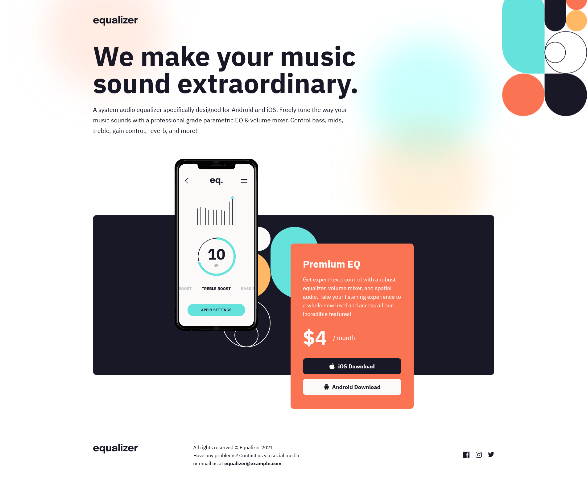

# Frontend Mentor - Equalizer landing page solution

This is a solution to the [Equalizer landing page challenge on Frontend Mentor](https://www.frontendmentor.io/challenges/equalizer-landing-page-7VJ4gp3DE). Frontend Mentor challenges help you improve your coding skills by building realistic projects.

## Table of contents

- [Overview](#overview)
  - [The challenge](#the-challenge)
  - [Screenshot](#screenshot)
  - [Links](#links)
- [My process](#my-process)
  - [Built with](#built-with)
  - [What I learned](#what-i-learned)
  - [Continued development](#continued-development)
- [Author](#author)

## Overview

Front end mentor challenge, that I attempted to improve my CSS

### The challenge

Build the page layout per Mockup

### Screenshot

### Links

- [Solution URL](https://danrichdan.github.io/equalizer-landing-page/)
- [Portfolio](https://danriches.com)

## My process

Mobile-first workflow. Determined what Markup would be needed to style it for each screen size

### Built with

- HTML5 markup
- CSS custom properties
- Flexbox
- Mobile-first workflow

### What I learned

I learned that if using positioning with responsive design, then many media queries are needed. I think there was an easier way to do this, wither with a change in the markup and then styles, and/or possiby grid.

### Continued development

I'd like to get better with Positioning, planning out the markup and css structure.

## Author

- Website - [Dan Riches](https://www.danriches.com)
- Frontend Mentor - [@danrichdan](https://www.frontendmentor.io/profile/danrichdan)
